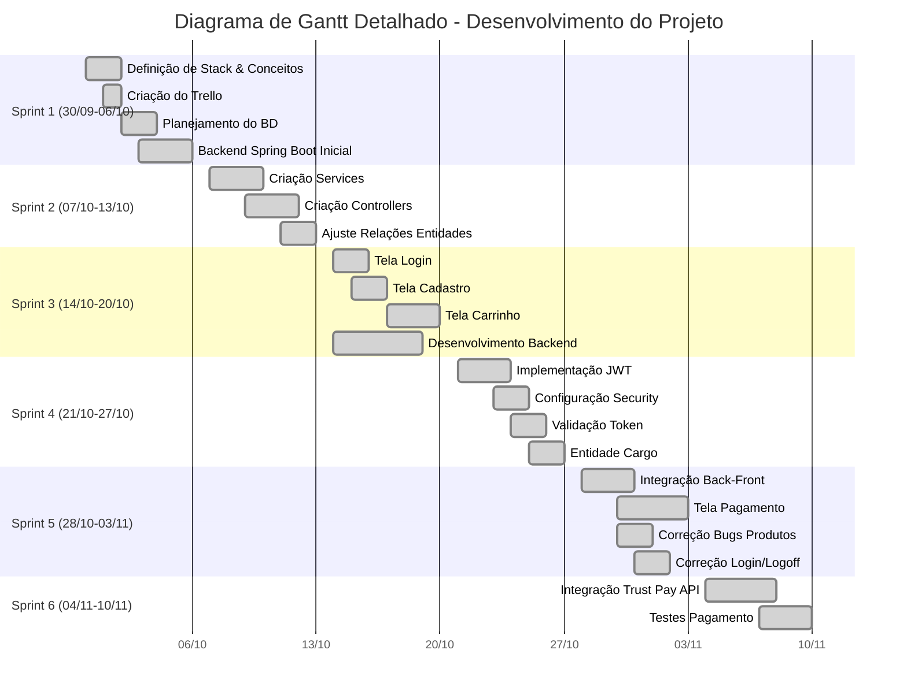

# GameStore — Frontend (Angular)

Este README documenta o frontend Angular do projeto "GameStore".
Inclui instruções de build, deploy (Render), variáveis de ambiente, páginas e exemplos de screenshots.

## Sumário

- Visão geral
- Funcionalidades / páginas
- Requisitos
- Variáveis de ambiente / build-time
- Scripts úteis
- Build para Render (deploy estático)
- Desenvolvimento local
- Estrutura do projeto (páginas e serviços)
- Como adicionar screenshots
- Troubleshooting

---

## Visão geral

Frontend feito com Angular (standalone components). Fornece as páginas principais da loja: catálogo, detalhes do jogo, carrinho, checkout, painel admin, perfil, login, register, thank-you (com keys geradas localmente).

Build-time env injection: este projeto gera `src/environments/environment.prod.ts` durante o build (script `set-env.js`) para injetar `apiUrl` e `authUrl` no bundle de produção.
SPA fallback: após o build, copiamos `index.html` → `200.html` para hospedar no Render e evitar 404 em rotas SPA.

---

## Funcionalidades / páginas

Páginas implementadas (resumo):
- Home
- Catalog (listagem de jogos, sem painel lateral de filtros)
- Game Details
- Cart
- Checkout (sem frete)
- Thank You (gera chaves fake por unidade e permite copiar)
- About
- Contact
- Login / Register
- Profile
- Admin (painel de estatísticas e ações de gerenciamento)

Serviços principais:
- `auth.service.ts` — login/logout/guarda de rotas
- `game.service.ts` — listagem/CRUD de jogos
- `category.service.ts` — categorias
- `user.service.ts` — endpoints relacionados a usuários (inclui `getUserCount()`)
- `order.service.ts` — criar e listar pedidos
- `cart.service.ts` — gerenciamento do carrinho no client-side

---

## Requisitos

- Node.js 18+ (recomendado)
- npm 9+
- Angular CLI (opcional para desenvolvimento)

---

## Variáveis de ambiente (build-time)

O projeto usa um script `set-env.js` para gerar `src/environments/environment.prod.ts` no build de produção. As variáveis esperadas (defina no ambiente de build do Render ou localmente antes de rodar o script):

- `API_URL` — URL base da API (ex.: `https://minha-api.onrender.com/api`)
- `AUTH_URL` — URL do provedor de autenticação (opcional)

No `package.json` existe o script `build:render` que chama o `set-env.js` e em seguida `ng build --configuration=production` e copia `index.html` para `200.html`.

---

## Scripts úteis

No diretório do frontend (`gameStore-front`):

```powershell
# instalar dependências
npm install

# desenvolvimento (dev server)
npm run start  # ou: ng serve --open

# build para render (gera environment.prod.ts e 200.html)
npm run build:render

# build de produção padrão
npm run build
```

---

## Build para Render

1. Configure as variáveis de ambiente no dashboard do Render (ou onde for hospedar): `API_URL` e `AUTH_URL`.
2. Use o script `build:render` como comando de build (já foi adicionado no package.json). Esse script:
   - escreve `src/environments/environment.prod.ts` com as variáveis
   - executa `ng build --configuration=production`
   - copia `dist/index.html` para `dist/200.html` para fallback SPA

No Render, escolha `Static Site` e aponte para a pasta `dist/<nome-do-app>` que o Angular gerar.

---

## Desenvolvimento local

1. Clone e instale dependências:
```powershell
npm install
```
2. Para desenvolvimento com live-reload:
```powershell
npm run start
```
3. Para testar integração com backend local (garanta que o `environment.ts` aponta para `http://localhost:8080/api`).

---

## Estrutura do projeto (onde ficam as coisas)

- `src/app/pages/` — principais páginas (home, catalog, admin, profile...)
- `src/app/services/` — serviços HTTP
- `src/app/models/` — modelos/DTOs (Game, User, Order, Cart)
- `src/environments/` — arquivos de environment; `environment.prod.ts` é gerado no build
- `set-env.js` — script para gerar `environment.prod.ts` no build
- `copy-index-to-200.js` — copia index para 200.html

---

## Ajustes visuais e UX

- O catálogo foi ajustado para remover o painel de filtros e centralizar os cartões de jogos.
- A página de agradecimento (`thank-you`) gera keys fake por unidade e possui botão de copiar.
- No perfil, botões de edição foram removidos conforme pedido do design.

---

## Screenshots (preencha com prints)

Crie uma pasta `docs/screenshots` e adicione as imagens. Em seguida substitua os links abaixo.

### Home


### Catálogo


### Admin - Painel


### Thank-you (chaves)


---

## Troubleshooting

- Se o build `build:render` falhar, verifique se as variáveis `API_URL` e `AUTH_URL` estão definidas no ambiente ou exportadas localmente.
- Se rotas do admin 404 no host (Render), confirme que o `200.html` está presente na pasta `dist`.
- CORS: se o frontend não consegue chamar a API, confira cabeçalhos CORS no backend.

---

# Nome de cada integrante e responsabilidade

| Nome     | Função de cada integrante     |
|---------------|---------------|
| Arthur Bonna  | Ajudou no planejamento das sprints    |
| Davi Tonn   | Ficou responsaval da maior parte do front-end em angular   |
| Kaio Levi   | Planejamento das sprints e ajudou um pouco no back-end   |
| Lucas   | Ficou responsavel por maior parte do back-end   |

# Sprints 

**SPRINT 1 - SEMANA 30/09 A 06/10**

**Objetivo da Sprint:** Planejamento inicial e estruturação do projeto

**Atividades Realizadas:**
- Definição da divisão de tarefas do projeto (stack, conceitos, funcionalidades principais)
- Criação do Trello para organização das tarefas
- Planejamento do banco de dados com definição das entidades:
  - Usuario, Jogo, RequisitoSistema, Categoria, Imagem, Key, Carrinho-jogo, Carrinho, Pedido
- Início do desenvolvimento do backend em Spring Boot
- Criação das classes básicas das entidades

**Entregas:**
- Board Trello organizado
- Estrutura inicial do backend Spring Boot
- Classes das entidades criadas

---

**SPRINT 2 - SEMANA 07/10 A 13/10**

**Objetivo da Sprint:** Estruturação das camadas do backend

**Atividades Realizadas:**
- Criação das pastas service e controller
- Ajuste das relações entre entidades para modelagem correta do banco de dados
- Configuração das dependências do Spring Boot

**Entregas:**
- Camadas service e controller implementadas
- Relacionamentos entre entidades ajustados

---

**SPRINT 3 - SEMANA 14/10 A 20/10**

**Objetivo da Sprint:** Início do desenvolvimento frontend e continuidade do backend

**Atividades Realizadas:**
- **Davi:** Desenvolvimento do frontend com criação das telas:
  - Login
  - Cadastro
  - Carrinho
- **Lucas:** Continuação do desenvolvimento backend

**Entregas:**
- Telas básicas do frontend criadas
- Progresso no desenvolvimento backend

---

**SPRINT 4 - SEMANA 21/10 A 27/10**

**Objetivo da Sprint:** Implementação do sistema de autenticação

**Atividades Realizadas:**
- Implementação do sistema de login com JWT (JSON Web Token)
- Configuração da classe de segurança
- Criação da validação de token
- Criação da entidade Cargo para controle de acesso

**Entregas:**
- Sistema de autenticação JWT funcionando
- Controle de acesso implementado
- Entidade Cargo criada

---

**SPRINT 5 - SEMANA 28/10 A 03/11**

**Objetivo da Sprint:** Integração frontend-backend e início da implementação de pagamento

**Atividades Realizadas:**
- Integração completa entre back-end e front-end
- Início do desenvolvimento da tela de pagamento
- Correção de bugs na tela de produtos
- Correção do sistema de login/logoff do usuário

**Entregas:**
- Sistema integrado funcionando
- Tela de pagamento em desenvolvimento
- Bugs críticos corrigidos

---

**SPRINT 6 - SEMANA 04/11 A 10/11**

**Objetivo da Sprint:** Implementação do sistema de pagamento

**Atividades Realizadas:**
- Integração da loja com API de pagamento Trust Pay
- Testes e validação do fluxo de pagamento

**Entregas:**
- Sistema de pagamento integrado e funcionando
- Fluxo completo de compra finalizado

---

**RESUMO DAS SPRINTS:**

| Sprint | Período | Foco Principal | Entregas |
|--------|---------|----------------|----------|
| 1 | 30/09-06/10 | Planejamento e estruturação | Trello, Backend base |
| 2 | 07/10-13/10 | Camadas do backend | Services e Controllers |
| 3 | 14/10-20/10 | Frontend inicial | Telas login, cadastro, carrinho |
| 4 | 21/10-27/10 | Autenticação | JWT e segurança |
| 5 | 28/10-03/11 | Integração e pagamento | Sistema integrado, tela pagamento |
| 6 | 04/11-10/11 | Pagamento externo | API Trust Pay integrada |

# Grafico GANTT



